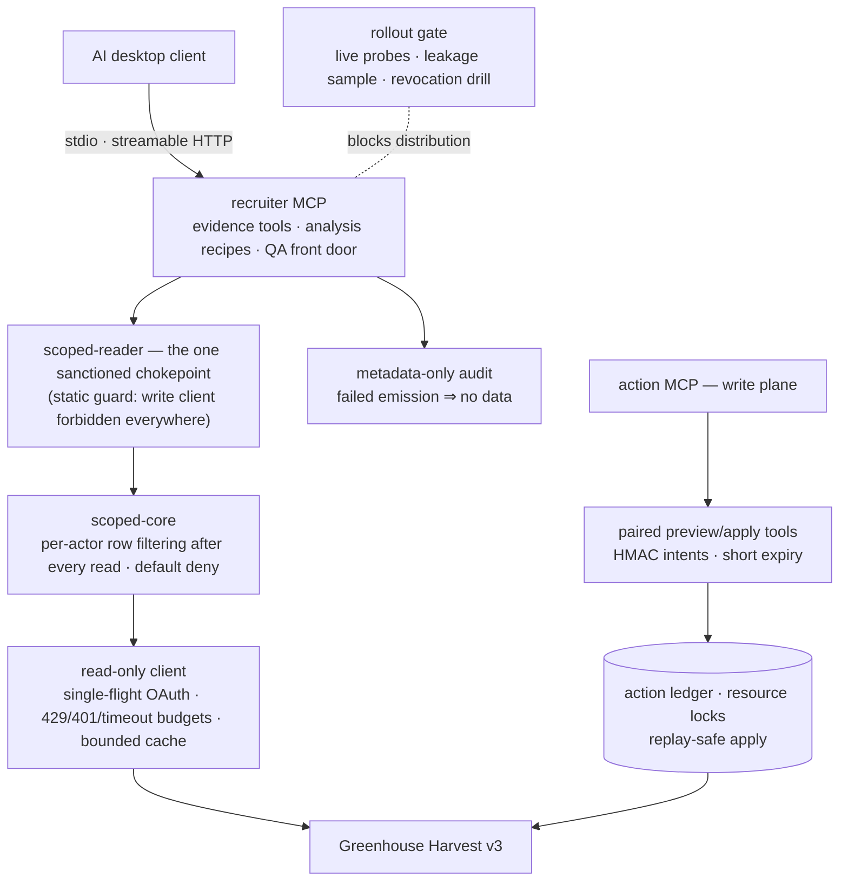
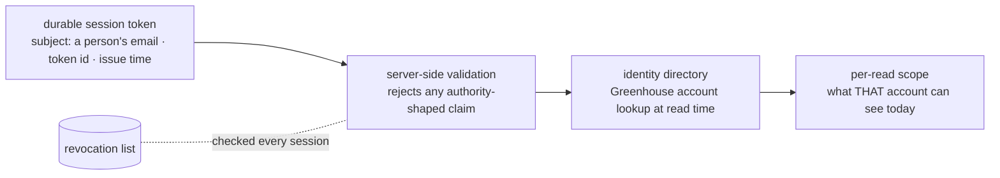

# Greenhouse MCP

Scoped MCP servers for Greenhouse — per-user permission enforcement on every read, paired preview/apply write intents, metadata-only audit, and an evidence-gated rollout.

Give an AI workspace a Greenhouse API key and you have handed every user the whole tenant: every candidate, every confidential requisition, every scorecard, regardless of what their own Greenhouse account is allowed to see. These servers take the opposite position — the ATS's own permission model is the boundary, and the server re-derives and enforces it on every single read, after every fetch, before anything reaches the model.



---

## Read-only by construction, and provably so

The claim that a server is read-only is usually a code-review promise. Here it is a static proof that runs in CI: `packages/recruiter-mcp/scripts/verify-guards.mjs` walks every runtime file and enforces two rules with no exemptions. The write-bearing Greenhouse client module may not be imported by any runtime file — the chokepoint included, at any relative path — and the raw read primitives may be named in exactly one place, `src/scoped-reader.ts`. Every other file gets its data through the chokepoint, which applies the actor's scope before returning anything.

That design earned its shape adversarially: an earlier version exempted the chokepoint file from the module rule, so reverting one import would have reloaded the full write surface with the guard still green. The guard's own test suite proves each rule fires, including that exact regression.

The scoping core underneath (`packages/scoped-core`) filters rows per actor after every fetch and denies by default: a user Greenhouse lists on nothing sees nothing, and an unrecognized permission shape fails closed rather than widening.

## A token names a person; the server decides what they see



Session tokens carry identity, never authority. Issuance refuses to embed roles or scopes; validation rejects any token that claims them anyway. What a recruiter can see is decided per read, from what Greenhouse says about their account at that moment — so a permission change in the ATS takes effect immediately, and a revoked token dies at the next session check. The evidence format for a rollout — issuance manifests, leakage samples, a revocation drill — ships as sanitized examples under `packages/recruiter-mcp/examples/rollout-evidence/`.

## Writes exist only as paired intents

The write plane (`packages/action-mcp`) exposes no direct mutation. Every action is a pair: a preview tool that computes and signs an intent — an HMAC over the exact change, expiring in minutes — and an apply tool that will execute only that signed intent, once, under a resource lock, with the outcome recorded in a ledger before Greenhouse is touched. A replayed apply is a no-op; an expired intent is a refusal; a drifted target voids the signature.

## Audit is a precondition, not a log

Every tool call emits metadata-only audit events — who, what tool, which scope, never candidate content. Emission failure means the data does not flow: the audit sink refusing is treated exactly like the permission check refusing. The rollout gate extends the same posture to distribution — a build cannot go to recruiters until live probes, a leakage sample over real responses, and a revocation drill have all passed and their evidence is on file.

---

## Packages

| Package | What it is |
|---|---|
| `packages/control-plane` | The unscoped operator MCP (~65 read tools) for the person who runs the ATS — see its `start-here.md` |
| `packages/scoped-core` | The security core: actor resolution and per-row permission filtering, dependency-free |
| `packages/recruiter-mcp` | The per-user server: scoped reads, evidence tools, analysis recipes, sessions, audit, rollout gate |
| `packages/action-mcp` | The write plane: paired preview/apply tools over signed intents and a ledger |

## Running it

```bash
npm ci
npm run verify   # builds the control plane, then typechecks, tests, and guards every package
```

The suite is credential-free: live probes and the Docker smoke harness are separate, documented commands that skip or refuse without their credentials. Each package's README covers its own deployment; the recruiter server ships a production Dockerfile built from the workspace root:

```bash
docker build -f packages/recruiter-mcp/deploy/Dockerfile .
```

Configuration is documented in each package's `production.env.example`. The Supabase project ref, service identities, and hostnames in this repository are shaped placeholders — every deployment supplies its own.

## Status

The scoped recruiter server ran a live pilot behind the rollout gate: real probes, a leakage sample over live responses, and a revocation drill, with the evidence format preserved here as sanitized examples. This repository is a fresh public cut of that system — one commit, with tenant identifiers replaced by shaped placeholders so every code path still exercises.
